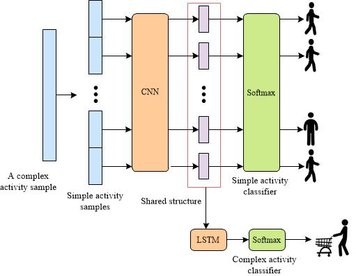
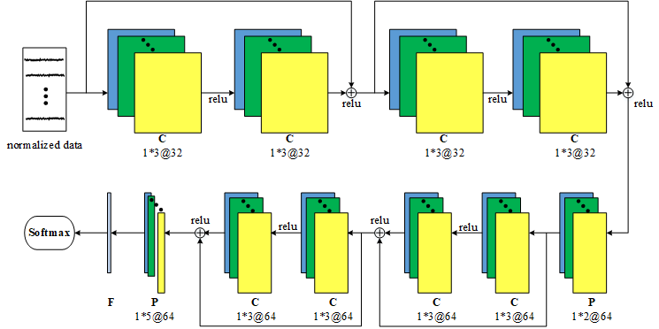

## AROMA: A Deep Multi-Task Learning Based Simple and Complex Human Activity Recognition Method Using Wearable Sensors


This is the implementation of our paper "A Deep Multi-Task Learning Based Simple and Complex Human Activity Recognition Method Using Wearable Sensors". This work has been accepted by Ubicomp 2018.
<br>



## The structure of the project
<li> Requirements: TensorFlow 1.2.1, Python 2.7
<li> config.py:  containing parameters the model will use, like window length of simple activity and complex activity, training parameters e.g., batch size, learning rate decay speed. The dataset path has to be appointed in "self.dataset" in config.
<li> utils.py: containing commonly used functions in the project
<li>joint_model.py: building and training the model
<li> main.py: entrance of the project

We preprocess the dataset by removing the unlabeled data and prune it into the proper window size, which can be downloaded at huynh.cp. 
You can run main.py -h to get the args:

```
python main.py -h
```

Three args would be listed:

```
optional arguments:
  -h, --help         show this help message and exit
  --test TEST        select the test day. Max num is 6
  --version VERSION  model version
  --gpu GPU          assign task to selected gpu
```

For leave-one-out cross-validation, the "test" option should be assigned to test one day data in the dataset. Therefore, for example, you can run:

```
python main.py --test 0 --version har-model --gpu 0
```


